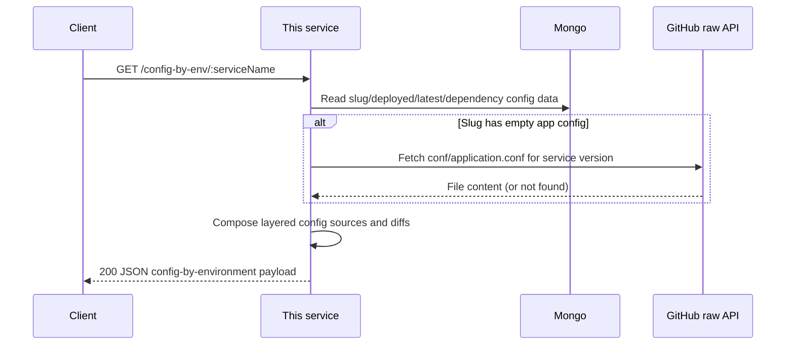
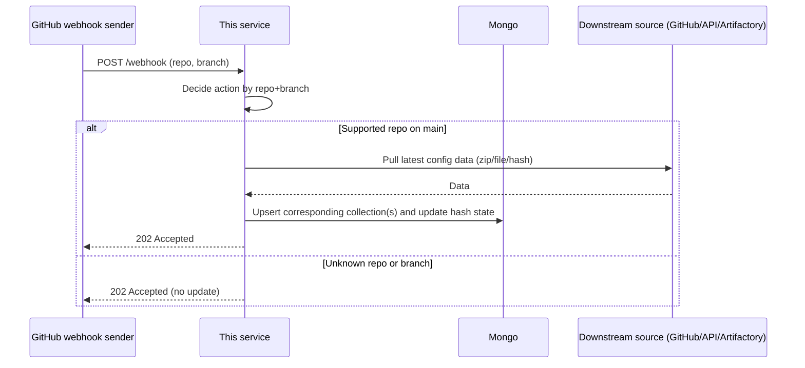
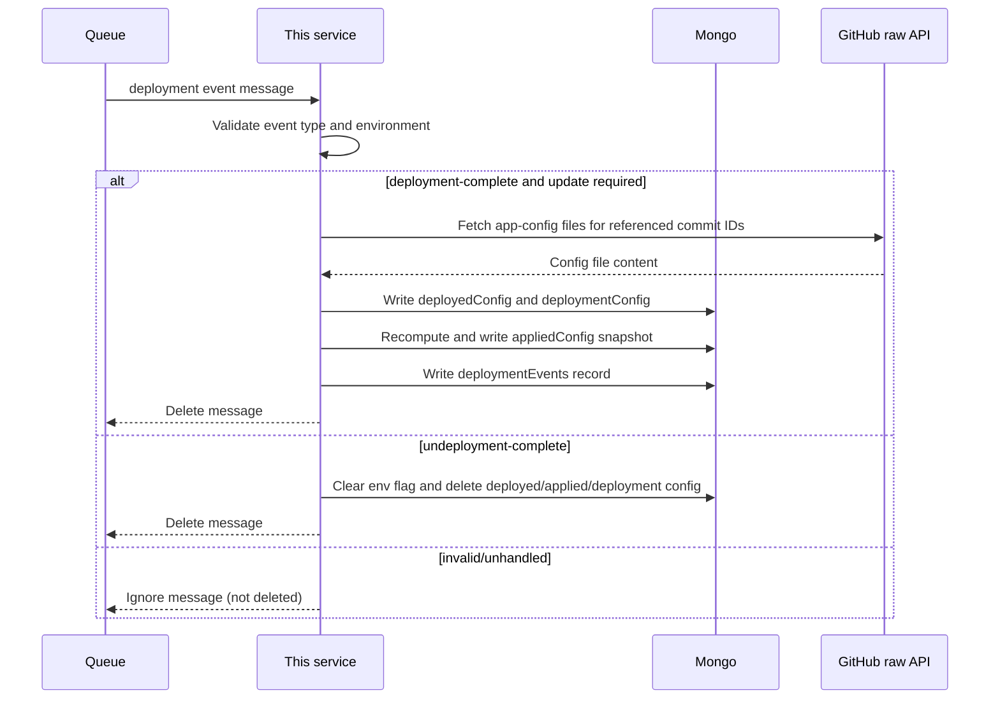
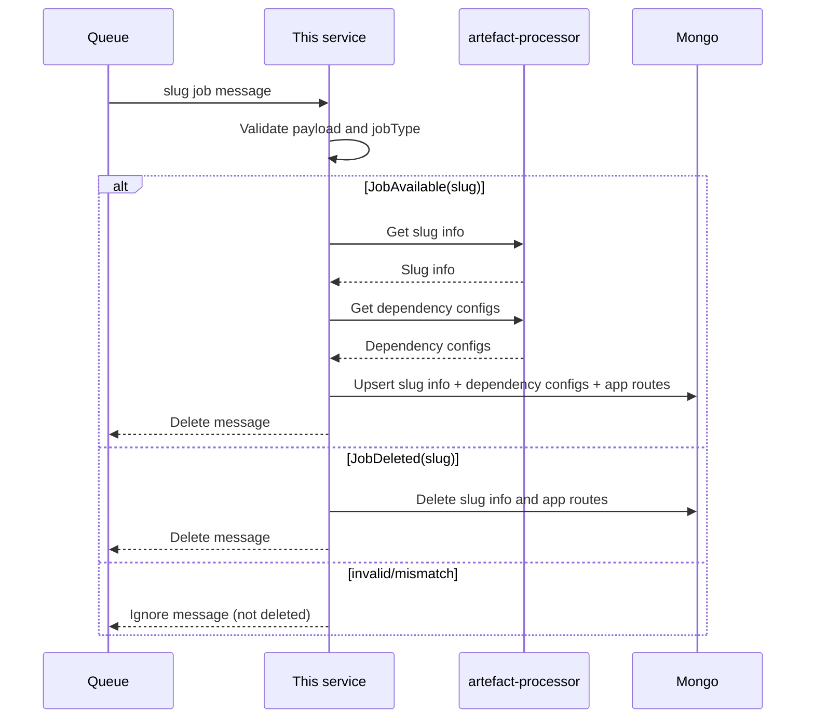
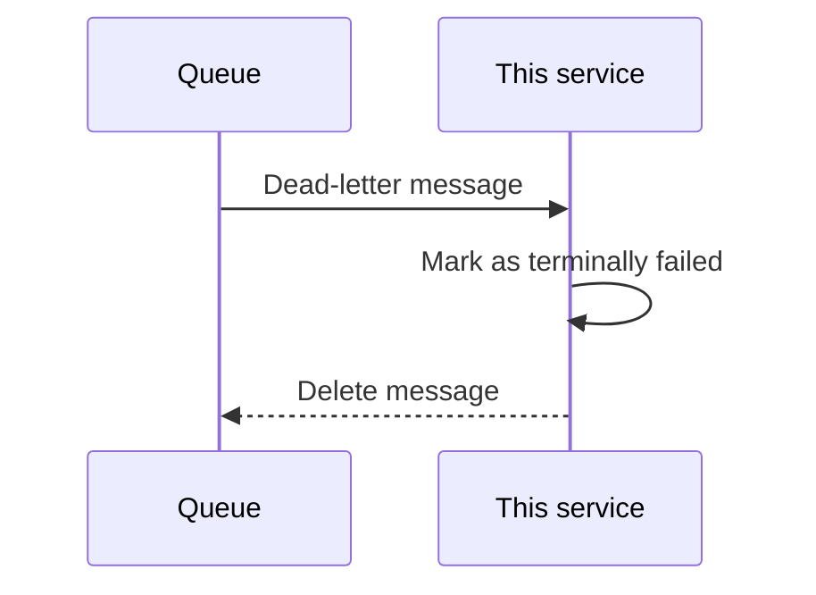
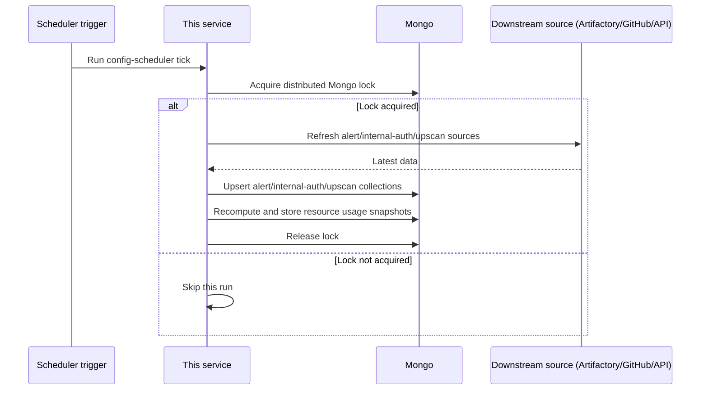
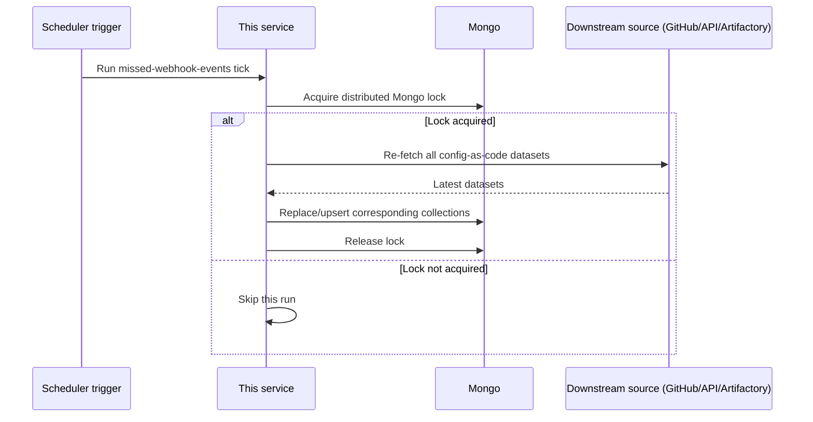
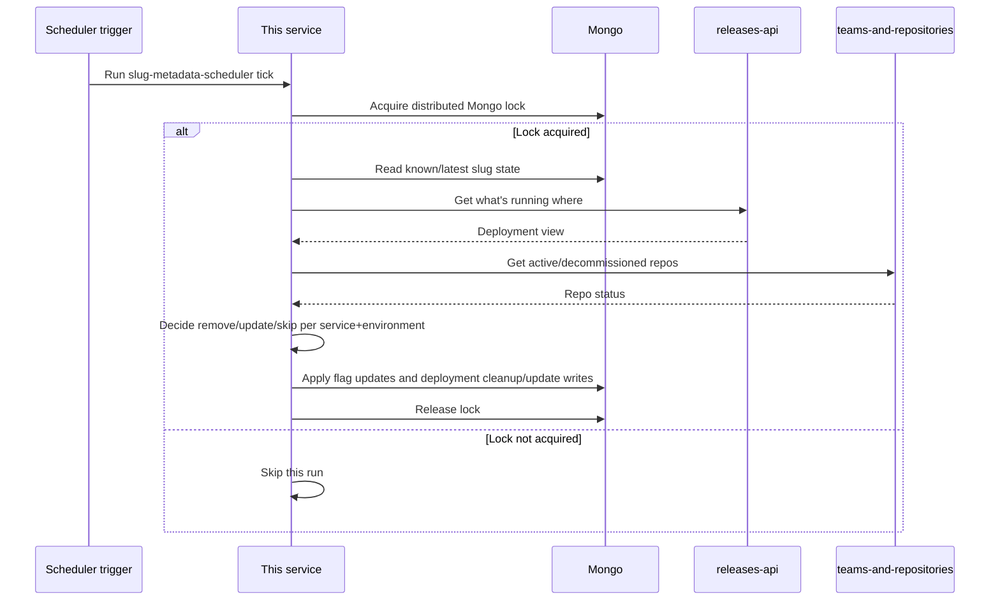

# Per-Flow Sequence Diagrams

## Service Configuration Lookup (GET /config-by-env/:serviceName)

## GitHub Webhook-Driven Refresh (POST /webhook)

## Deployment Event Processing (SQS)

## Slug Event Processing (SQS)

## Dead-Letter Queue Processing

## Scheduled Configuration Synchronisation

## Missed Webhook Catch-Up (Scheduled Job)

## Slug Metadata Reconciliation (Scheduled Job)

