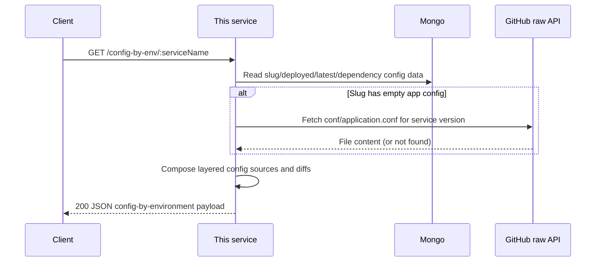
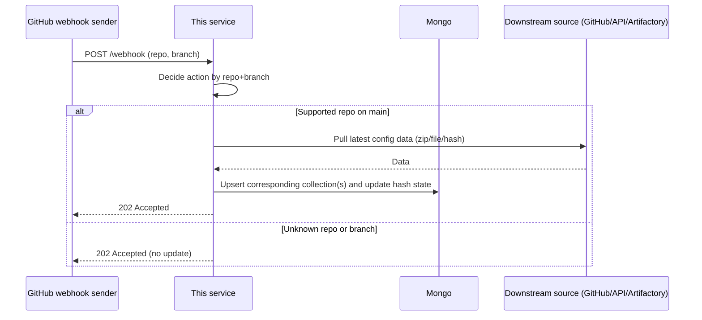
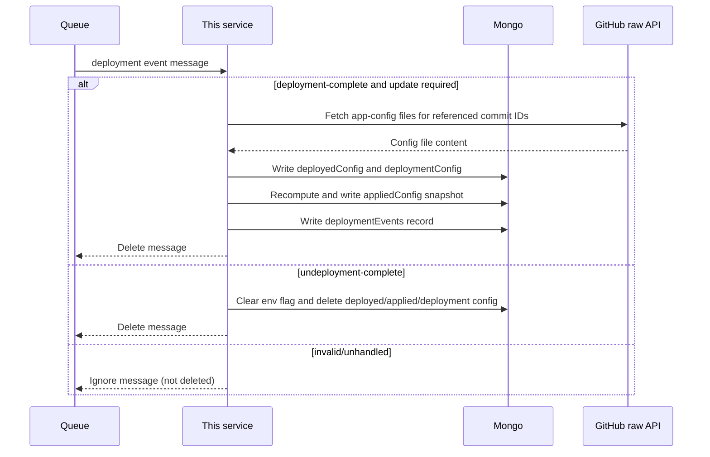
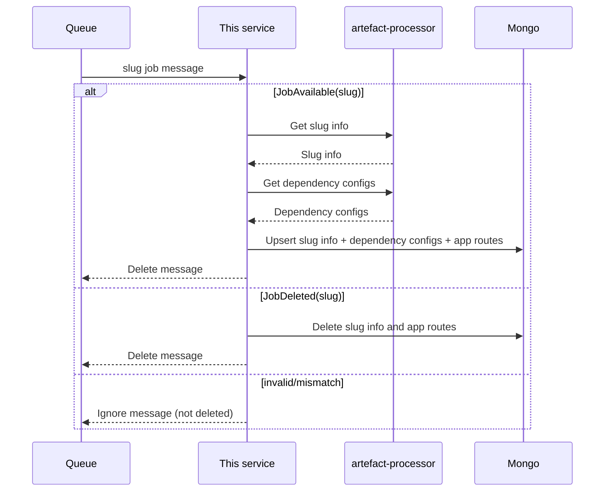
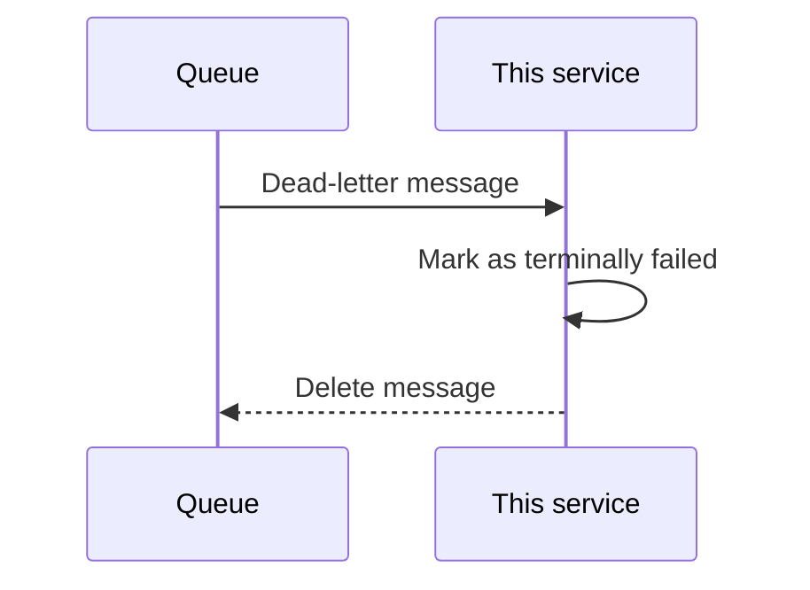
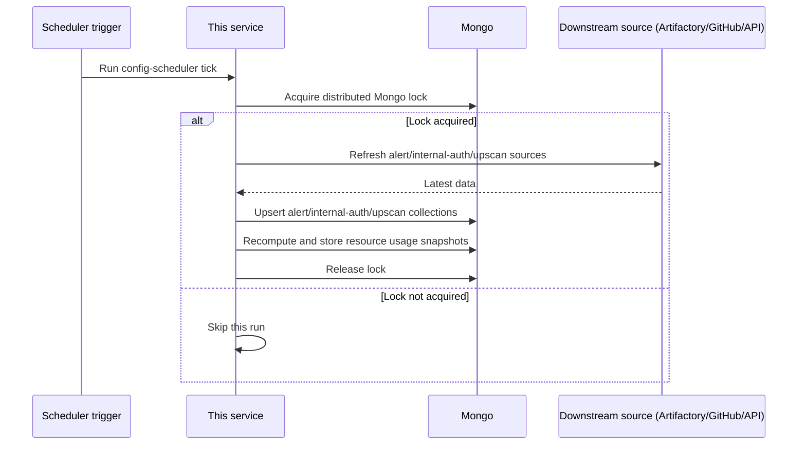
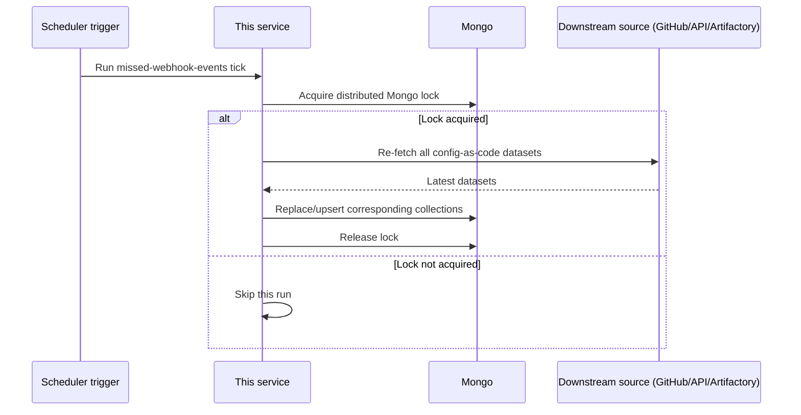
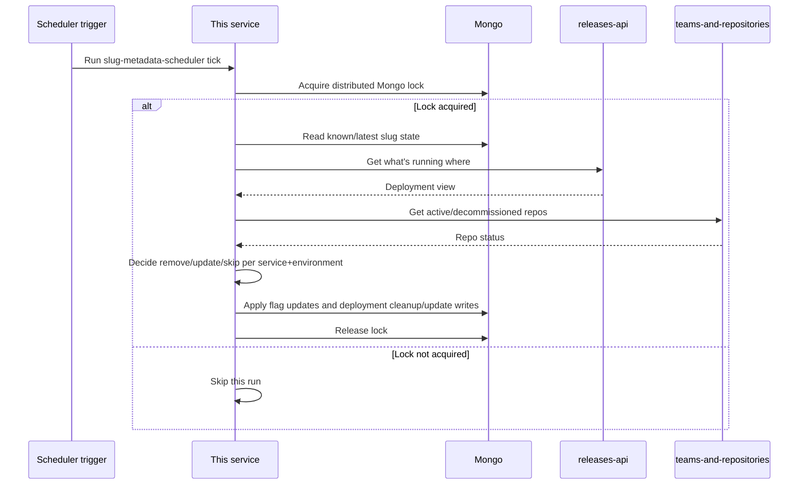

# Service Configs

Service-configs is the single place where HMRC service configuration lives.
It collects key setup details (like deployment settings, routing, and service metadata) from different sources and makes them available through APIs to tools such as Catalogue.


## Service Configuration Lookup (GET /config-by-env/:serviceName)

Gets the final config for a service in each environment (for example, dev, qa, or prod).

It works this out by merging:
- what is currently deployed,
- config from services it depends on, and
- environment-specific overrides.

The response shows the config the service will actually run with.



## GitHub Webhook-Driven Refresh (POST /webhook)

When GitHub says a config repo changed, this service checks if it cares about that repo/branch.
If yes, it pulls the latest data and updates Mongo. If not, it safely ignores it.



## Deployment Event Processing (SQS)


Reads deployment messages from a queue and updates what is marked as deployed in each environment.
It stores the latest deployed/applied config and cleans up when something is undeployed.



## Slug Event Processing (SQS)

Reads slug job messages and keeps slug metadata in sync.
It adds/updates slug details when a slug appears, and removes them when a slug is deleted.




## Dead-Letter Queue Processing


Handles messages that failed too many times.
Marks them as permanently failed and removes them from the dead-letter queue.




## Scheduled Configuration Synchronisation


A timed background job that refreshes config data from external sources.
Uses a lock so only one instance runs the sync at a time.




## Missed Webhook Catch-Up (Scheduled Job)

A safety-net job that re-fetches all config datasets in case webhook events were missed.
Also uses a lock to avoid duplicate runs.



## Slug Metadata Reconciliation (Scheduled Job)

A timed job that compares stored slug data with current deployment/repo state.
It fixes stale records by updating flags and cleaning up old deployment data.


-----------------------------------------------------------------------------------------------------------------------------------------------------------------------
-----------------------------------------------------------------------------------------------------------------------------------------------------------------------

## Mongo Collections

### Collection: `appliedConfig`
Description: Stores the final effective config values per service key across environments. Used by `GET /config-by-env/:serviceName` to return what config a service is actually running with.

```json
{
  "serviceName": "example-service",
  "key": "microservice.services.auth.host",
  "environments": {
    "production": {
      "source": "appConfigEnvironment",
      "sourceUrl": "https://github.com/hmrc/...",
      "value": "https://auth.service"
    }
  },
  "onlyReference": false
}
```

---

### Collection: `deployedConfig`
Description: Records the app-config file content that was active at the point a deployment happened. Used to detect config changes between deployments.

```json
{
  "serviceName": "example-service",
  "environment": "production",
  "deploymentId": "dep-abc123",
  "configId": "cfg-xyz456",
  "appConfigBase": "# base config...",     // optional
  "appConfigCommon": "# common config...", // optional
  "appConfigEnv": "# env config...",       // optional
  "lastUpdated": "2026-08-12T10:00:00Z"
}
```

---

### Collection: `deploymentConfig`
Description: Stores non-app deployment settings such as capacity, zone, environment variables and JVM options per service and environment. Sourced from app-config-env files.

```json
{
  "name": "example-service",
  "artefactName": "example-service", // optional
  "environment": "production",
  "zone": "public",
  "type": "backend",
  "slots": "2",
  "instances": "4",
  "envVars": { "HTTP_PORT": "9000" },
  "jvm": { "Xmx": "1024m" },
  "applied": true
}
```

---

### Collection: `deploymentEvents`
Description: Audit record of each processed deployment event. Used to track what version was deployed where and whether config changed.

```json
{
  "serviceName": "example-service",
  "environment": "production",
  "version": "1.2.3",
  "deploymentId": "dep-abc123",
  "configChanged": true,              // optional
  "deploymentConfigChanged": false,   // optional
  "configId": "cfg-xyz456",         // optional
  "lastUpdated": "2026-08-12T10:00:00Z"
}
```

---

### Collection: `slugConfigurations`
Description: System-of-record for each published slug. Stores artifact metadata, embedded config files, and dependency list. Used to answer what is deployed and to compose effective config.

```json
{
  "uri": "example-service_1.2.3",
  "created": "2026-08-12T10:00:00Z",
  "name": "example-service",
  "version": "1.2.3",
  "dependencies": [
    { "path": "lib/bootstrap.jar", "version": "8.0.0", "group": "uk.gov.hmrc", "artifact": "bootstrap-backend-play-30", "meta": "" }
  ],
  "applicationConfig": "# application.conf...", // optional
  "includedAppConfig": { "app-config-common": "..." }, // optional
  "loggerConfig": "# logger config...",          // optional
  "slugConfig": "# slug config..."               // optional
}
```

---

### Collection: `dependencyConfigs`
Description: Stores config fragments bundled with specific dependency versions. Used during config composition to include dependency-level defaults.

```json
{
  "group": "uk.gov.hmrc",
  "artefact": "bootstrap-backend-play-30",
  "version": "8.0.0",
  "configs": { "microservice.services.auth.port": "8500" }
}
```

---

### Collection: `resourceUsage`
Description: Time-series snapshots of slot and instance counts per service and environment. Has a 7-year TTL. Used for resource usage reporting and trending.

```json
{
  "date": "2026-08-12T10:00:00Z",
  "serviceName": "example-service",
  "environment": "production",
  "slots": 2,
  "instances": 4,
  "latest": true,
  "deleted": false
}
```

---

### Collection: `lastHashString`
Description: Tracks the last known git hash for each config source repo. Prevents redundant re-processing when nothing has changed.

```json
{
  "key": "app-config-base",
  "hash": "abc123def456"
}
```

---

### Collection: `latestConfig`
Description: Caches the latest (HEAD) content of config files per repo. Used to avoid re-fetching unchanged files from GitHub.

```json
{
  "repoName": "app-config-base",
  "fileName": "example-service.yaml",
  "content": "# file content..."
}
```

---

### Collection: `alertEnvironmentHandlers`
Description: Stores which environments a service has alert handlers configured for. Refreshed by the scheduled config sync job.

```json
{
  "serviceName": "example-service",
  "production": true,
  "location": "https://github.com/hmrc/alert-config/..."
}
```

---

### Collection: `internalAuthConfig`
Description: Stores internal-auth grant configuration per service and environment. Refreshed by the scheduled config sync job.

```json
{
  "serviceName": "example-service",
  "environment": "production",
  "grantType": "grantee"
}
```

---

### Collection: `upscanConfig`
Description: Stores Upscan file upload service configuration per service and environment. Refreshed by the scheduled config sync job.

```json
{
  "service": "example-service",
  "location": "https://github.com/hmrc/upscan-app-config/...",
  "environment": "production"
}
```
